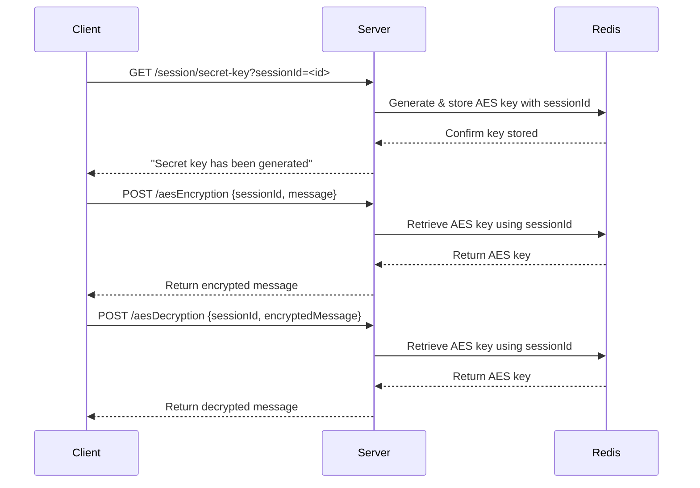

# Java Security RND

A **Spring Boot WebFlux application** demonstrating basic **security operations**:

* **Encoding/Decoding** (Base64)
* **Hashing** (SHA-256)
* **AES Encryption/Decryption** (session-based keys with Redis)

The project is **reactive**, using **Project Reactor** and **Redis** for managing AES session keys.

---

## Features

1. **Encoding** – Convert a plaintext message into Base64 format. Use when you need to safely send binary data (like images or files) as text in APIs or over the internet.
2. **Decoding** – Convert a Base64 encoded message back to the original plaintext. Use when you receive Base64 data and need to convert it back to its original form.
3. **Hashing** – Generate a SHA-256 hash of a message. Use to store passwords securely, verify data integrity, or generate digital signatures.
4. **AES Encryption** – Encrypt messages using a session-specific AES key stored in Redis. Use to keep sensitive messages private during transmission or storage.
5. **AES Decryption** – Decrypt messages using the session-specific AES key retrieved from Redis. Use to read messages that were encrypted with AES, ensuring only authorized users can access them.

---

## Table of Contents

1. [Getting Started](#getting-started)
2. [Prerequisites](#prerequisites)
3. [Running the Application](#running-the-application)
4. [API Endpoints](#api-endpoints)
5. [AES Session Key Flow](#aes-session-key-flow)

---

## Getting Started

Clone the repository:

```bash
git clone <your-repo-url>
cd java-security-rnd
```

Build the project:

```bash
./gradlew clean build
```

---

## Prerequisites

* **Java 21**
* **Gradle 8+**
* **Redis server** running locally or remotely

Optional: Run Redis via Docker:

```bash
docker run --name redis -p 6379:6379 -d redis
```

---

## Running the Application

Start the Spring Boot application:

```bash
./gradlew bootRun
```

The server runs on `http://localhost:8080` by default.

---

## API Endpoints

### 1. Encoding

Convert a message to **Base64**:

```http
POST /security/encode
Content-Type: application/json

{
  "message": "Hello World"
}
```

**Response:**

```json
{
  "encodedMessage": "SGVsbG8gV29ybGQ="
}
```

---

### 2. Decoding

Decode a **Base64** message:

```http
POST /security/decode
Content-Type: application/json

{
  "encodedMessage": "SGVsbG8gV29ybGQ="
}
```

**Response:**

```json
{
  "originalMessage": "Hello World"
}
```

---

### 3. Hashing

Generate a **SHA-256 hash** of a message:

```http
POST /security/hashing
Content-Type: application/json

{
  "message": "Hello World"
}
```

**Response:**

```json
{
  "sha256ConvertedMessage": "a591a6d40bf420404a011733cfb7b190d62c65bf0bcda32b..."
}
```

---

### 4. AES Session Key

Generate an **AES session key** for the client:

```http
GET /session/secret-key?sessionId=<client-session-id>
```

**Response:**

```
BASE64_ENCODED_AES_KEY
```

* `sessionId` is a unique identifier for the client session.
* The server stores the AES key in **Redis** mapped to this session ID.

---

### 5. AES Encryption

Encrypt a message using the session AES key:

```http
POST /security/aesEncryption
Content-Type: application/json

{
  "sessionId": "client123",
  "message": "Hello World"
}
```

**Response:**

```json
{
  "encryptedMessage": "BASE64_ENCRYPTED_STRING"
}
```

---

### 6. AES Decryption

Decrypt a message using the session AES key:

```http
POST /security/aesDecryption
Content-Type: application/json

{
  "sessionId": "client123",
  "encryptedMessage": "BASE64_ENCRYPTED_STRING"
}
```

**Response:**

```json
{
  "originalMessage": "Hello World"
}
```

---

## AES Session Key Flow

1. Client requests a session key via `/session/secret-key`.
2. Server generates a **random AES key** and stores it in Redis with `sessionId`.
3. Client sends messages to `/aesEncryption` along with `sessionId`.
4. Server fetches the key from Redis and encrypts the message.
5. For decryption, client sends `sessionId` and ciphertext to `/aesDecryption`.
6. Server retrieves the AES key and decrypts the message.



> **Security Note:**
> AES keys are **never sent repeatedly**. HTTPS should always be used for the initial key delivery.

---
